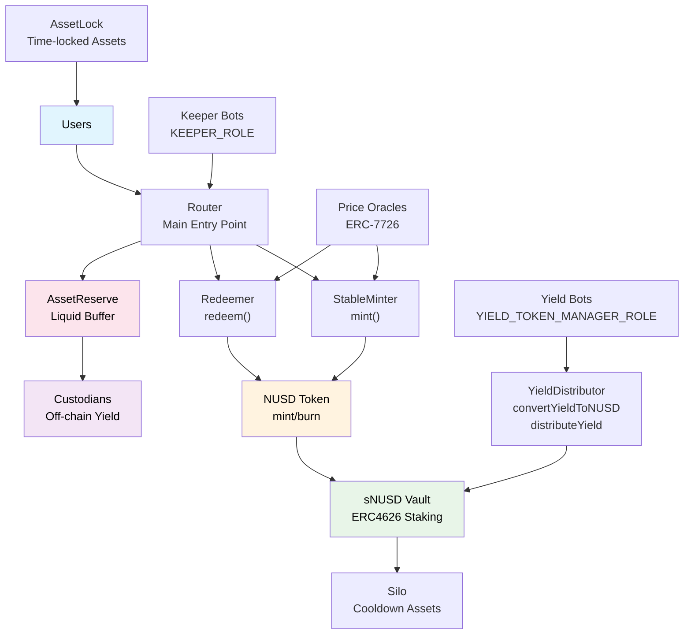
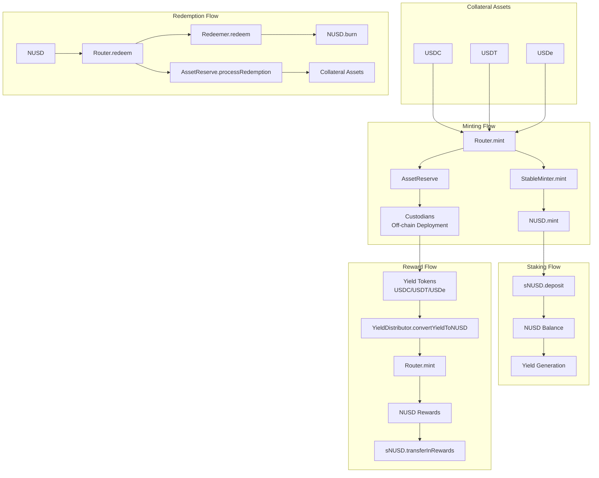
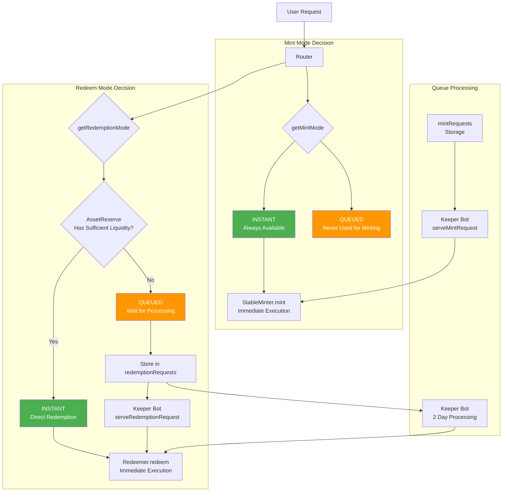
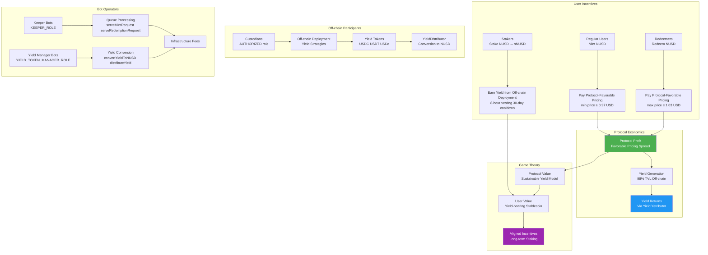
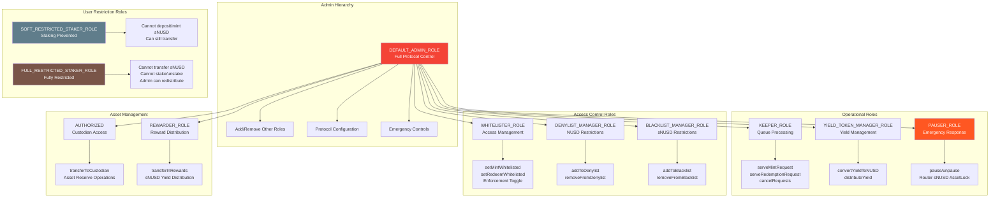
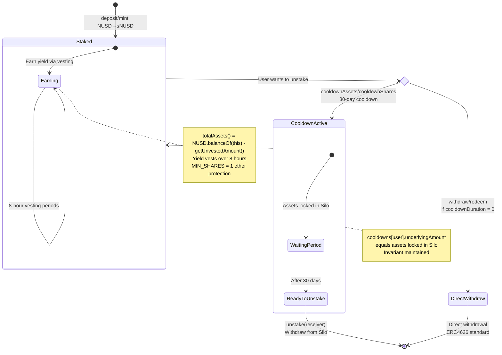
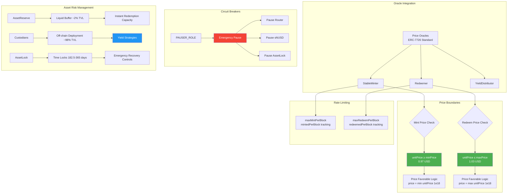
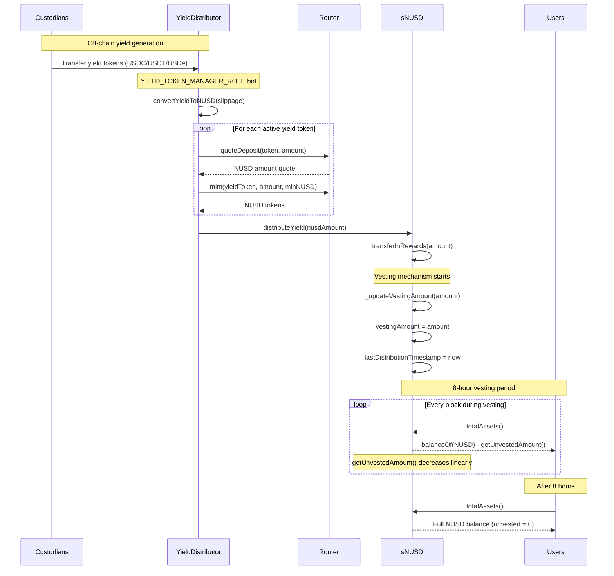
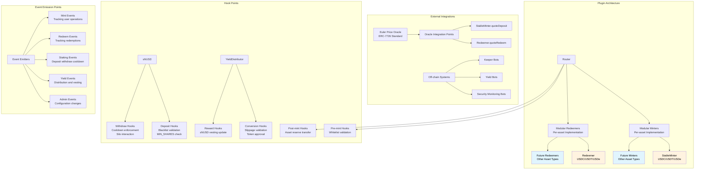

# Neutrl Protocol System Architecture Diagrams

## 1. High-Level System Architecture

## 2. Token Flow Architecture

## 3. Dual-Mode Operations Flow

## 4. Tokenomics & Economic Incentives

## 5. Role-Based Access Control & Governance

## 6. Staking & Cooldown Mechanism

## 7. Price Oracle & Risk Management

## 8. Yield Distribution & Vesting Flow

## 9. Security Architecture & Invariant Protection

```mermaid
graph TD
    subgraph "Core Invariants"
        I1[sNUSD totalAssets ≥ totalSupply<br/>Asset backing integrity]
        I2[cooldownAmount = siloLockedAmount<br/>Cooldown synchronization]
        I3[sum userLocks = totalLocked<br/>Lock accounting integrity]
        I4[totalSupply = 0 OR ≥ MIN_SHARES<br/>Donation attack protection]
    end
    
    subgraph "Access Control Enforcement"
        AC1[Role-based permissions<br/>SingleAdminAccessControl]
        AC2[Whitelist enforcement<br/>Router entry points]
        AC3[Blacklist restrictions<br/>Transfer and staking controls]
        AC4[Emergency pause capabilities<br/>PAUSER_ROLE activation]
    end
    
    subgraph "Economic Security"
        ES1[Protocol-favorable pricing<br/>0.97-1.03 USD bounds]
        ES2[Rate limiting per block<br/>maxMintPerBlock maxRedeemPerBlock]
        ES3[Slippage protection<br/>minNusdAmount minCollateralAmount]
        ES4[Oracle price validation<br/>ERC-7726 integrated checks]
    end
    
    subgraph "Asset Custody Security"
        AS1[Multi-role AssetReserve<br/>Custodian authorization required]
        AS2[Time-locked AssetLock<br/>182.5-365 day enforced locks]
        AS3[Silo cooldown enforcement<br/>30-day unstaking period]
        AS4[Asset reserve liquid buffer<br/>~2% TVL instant redemption]
    end
    
    subgraph "State Consistency Checks"
        SC1[Request status transitions<br/>PENDING→COMPLETED/CANCELLED only]
        SC2[Vesting amount precision<br/>unvestedAmount ≤ vestingAmount]
        SC3[Queue asset conservation<br/>held assets = pending requests sum]
        SC4[Price bounds validation<br/>All operations within limits]
    end
    
    I1 --> AC1
    I2 --> AS3
    I3 --> AS2
    I4 --> ES1
    
    AC1 --> ES1
    AC2 --> ES2
    AC3 --> AS1
    AC4 --> SC1
    
    style I1 fill:#4caf50,color:#fff
    style I2 fill:#4caf50,color:#fff
    style I3 fill:#4caf50,color:#fff
    style I4 fill:#4caf50,color:#fff
    style AC4 fill:#f44336,color:#fff
```

## 10. Integration & Hook Points

