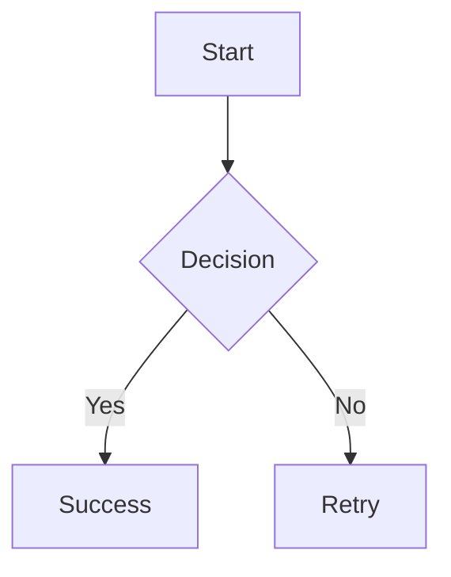
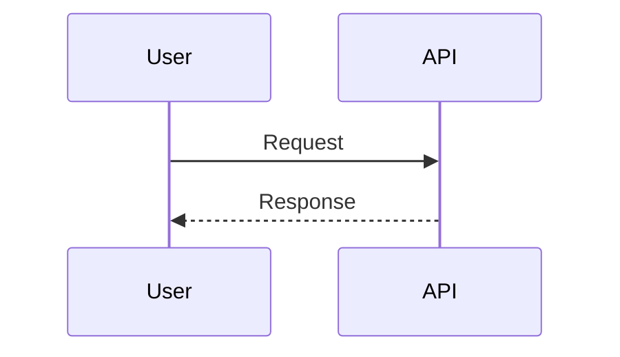

# gfm-pdf

A command-line tool that converts Markdown files to PDF with support for math formulas, Mermaid diagrams, and syntax highlighting. Designed for creating single-page PDFs optimized for e-ink devices and technical documentation.


## Features

- 📝 **GitHub Flavored Markdown** support (tables, task lists, strikethrough)
- 🧮 **Mathematical formulas** using KaTeX
- 📊 **Mermaid diagrams** (flowcharts, sequence diagrams, git graphs, etc.)
- 🎨 **Syntax highlighting** for code blocks with multiple themes
- 📄 **Single-page PDF output** optimized for e-ink devices
- 🎯 **Multiple page formats** (A4, A3, Letter, Legal)
- 🎨 **Custom CSS styling** support
- ⚡ **Fast rendering** using Playwright
- 🔧 **Configurable options** for all features

## Installation

### Global Installation (Recommended)

```bash
npm install -g gfm-pdf
```

### Local Installation

```bash
npm install gfm-pdf
```

## Usage

### Basic Usage

```bash
gfm-pdf input.md
```

This will convert `input.md` to `input.pdf` in the same directory.

### Specify Output File

```bash
gfm-pdf input.md -o output.pdf
```

### Complete Example

```bash
gfm-pdf document.md \
  --output ./dist/document.pdf \
  --theme monokai \
  --format A4 \
  --margins "1cm" \
  --css ./custom-styles.css \
  --verbose
```

## Command Line Options

| Option | Short | Description | Default |
|--------|-------|-------------|---------|
| `--output <path>` | `-o` | Output PDF file path | `{input}.pdf` |
| `--theme <theme>` | `-t` | Syntax highlighting theme | `github` |
| `--format <format>` | `-f` | Page format (A4, A3, Letter, Legal) | `A3` |
| `--margins <margins>` | `-m` | Page margins in CSS format | `0.5cm` |
| `--css <path>` | | Custom CSS file path | |
| `--no-math` | | Disable math formula support | |
| `--no-mermaid` | | Disable Mermaid diagram support | |
| `--no-syntax` | | Disable syntax highlighting | |
| `--verbose` | `-v` | Enable verbose output | `false` |

### Available Syntax Highlighting Themes

- `github` (default)
- `monokai`
- `dracula`
- `nord`
- `solarized-light`
- `solarized-dark`
- `vs-code-dark`
- `atom-one-dark`

## Supported Features

### Mathematics

Supports both inline and display math using KaTeX syntax:

~~~markdown
Inline math: $E = mc^2$

Display math:
$$
\int_{-\infty}^{\infty} e^{-x^2} dx = \sqrt{\pi}
$$

Math in code blocks:
```math
price = \max(unitPrice, 1e18)
collateralAmount = \frac{nusdAmount \times 10^{decimals}}{price}
```

~~~

### Mermaid Diagrams

Supports all Mermaid diagram types:

~~~markdown



~~~

### Code Syntax Highlighting

Supports 100+ programming languages:

~~~markdown
```javascript
function hello(name) {
  console.log(`Hello, ${name}!`);
}
```

```python
def fibonacci(n):
    return n if n <= 1 else fibonacci(n-1) + fibonacci(n-2)
```
~~~

### GitHub Flavored Markdown

- ✅ Tables
- ✅ Task lists
- ✅ Strikethrough text
- ✅ Blockquotes
- ✅ Links and images
- ✅ Nested lists

## Custom Styling

You can customize the PDF appearance using a CSS file:

```css
/* custom-styles.css */
body {
  font-family: 'Georgia', serif;
  line-height: 1.8;
  color: #2c3e50;
}

h1, h2, h3 {
  color: #34495e;
  border-bottom: 2px solid #3498db;
  padding-bottom: 0.3em;
}

pre {
  background-color: #f8f9fa;
  border: 1px solid #e9ecef;
  border-radius: 6px;
  padding: 16px;
}

blockquote {
  border-left: 4px solid #3498db;
  margin: 0;
  padding-left: 1em;
  font-style: italic;
}
```

Then use it with:

```bash
gfm-pdf document.md --css custom-styles.css
```

## E-ink Device Optimization

The tool is specifically designed for e-ink devices with these optimizations:

- **Single-page layout** - No page breaks for continuous reading
- **High contrast** - Black text on white background
- **Proper margins** - Comfortable reading spacing
- **A3 default format** - More content per page

### Recommended Settings for E-ink

```bash
gfm-pdf document.md \
  --format A4 \
  --margins "1.5cm" \
  --theme github \
  --output document.pdf
```

## Examples

### Technical Documentation

Perfect for converting technical docs with code examples, diagrams, and formulas:

```bash
gfm-pdf api-documentation.md \
  --output ./docs/api-guide.pdf \
  --theme vs-code-dark \
  --format A4
```

### Academic Papers

Ideal for research papers with mathematical notation:

```bash
gfm-pdf research-paper.md \
  --output paper.pdf \
  --format Letter \
  --margins "2cm" \
  --theme github
```

### Architecture Diagrams

Great for system design documents with Mermaid diagrams:

```bash
gfm-pdf system-design.md \
  --output architecture.pdf \
  --format A3 \
  --verbose
```

## Troubleshooting

### Common Issues

**"Input file does not exist"**

- Check the file path and ensure the file exists
- Use absolute paths if relative paths don't work

**"Playwright browser not found"**

- Run `npx playwright install` to install required browsers
- This happens automatically during `npm install`

**Math formulas not rendering**

- Ensure you're using proper KaTeX syntax
- Check for unclosed math delimiters (`$` or `$$`)

**Mermaid diagrams not appearing**

- Verify your Mermaid syntax is correct
- Test diagrams on [Mermaid Live Editor](https://mermaid.live/)

**Custom CSS not applied**

- Check the CSS file path is correct
- Ensure CSS syntax is valid

### Performance Tips

- For large documents, consider splitting into smaller files
- Use `--verbose` flag to monitor conversion progress
- Custom CSS can impact rendering speed

## Development

### Building from Source

```bash
git clone https://github.com/arash16/gfm-pdf
cd gfm-pdf
npm install
npm run build
```

### Running in Development

```bash
npm run dev input.md --output output.pdf
```

## License

This project is licensed under the MIT License - see the [LICENSE](LICENSE) file for details.

## Acknowledgments

- [Playwright](https://playwright.dev/) for PDF generation
- [KaTeX](https://katex.org/) for mathematical notation
- [Mermaid](https://mermaid.js.org/) for diagrams
- [Remark](https://remark.js.org/) for Markdown processing
- [Prism](https://prismjs.com/) for syntax highlighting

## Support

- 🐛 [Issue Tracker](https://github.com/arash16/gfm-pdf/issues)
- 💬 [Discussions](https://github.com/arash16/gfm-pdf/discussions)

---

**Made with KosseKhari ❤️ (Vibe Coding) methodologies!**
