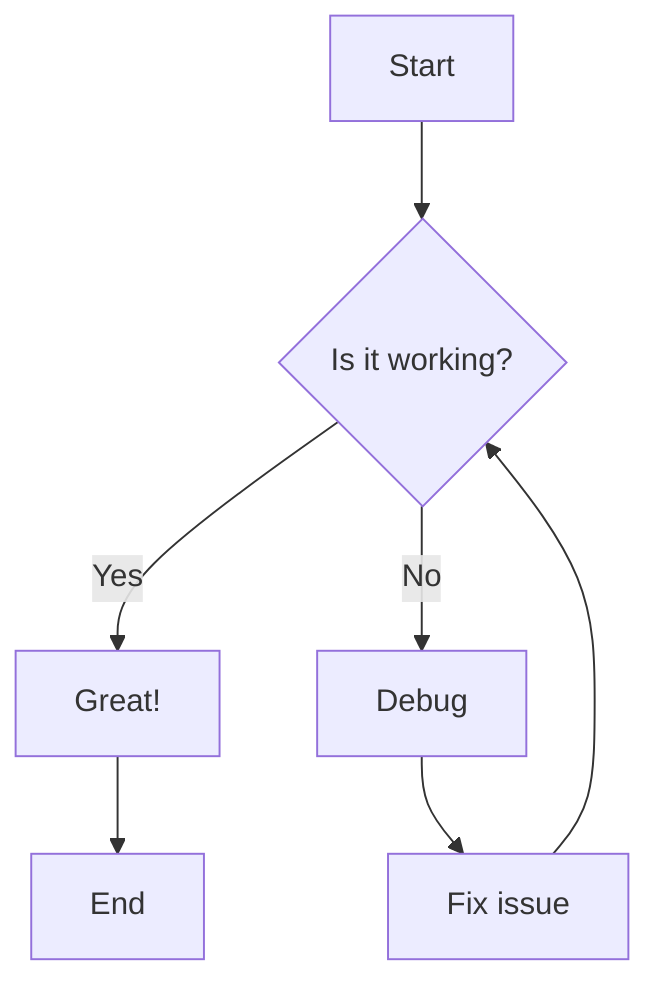
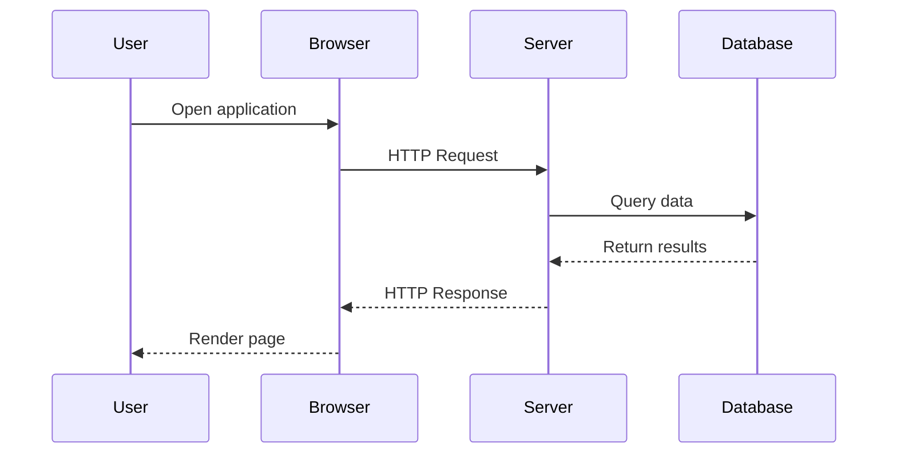
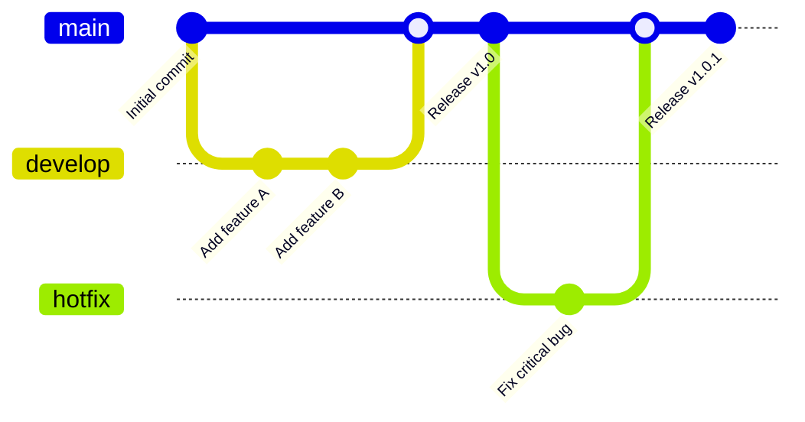

# Markdown to PDF Converter

This is a demonstration of the markdown to PDF converter with support for various technical documentation features.

## Features

- **Math formulas** using KaTeX
- **Mermaid diagrams** for flowcharts and diagrams
- **Syntax highlighting** for code blocks
- **GitHub Flavored Markdown** features like tables and strikethrough

## Math Formulas

Here's an inline math formula: $E = mc^2$

And here's a display formula:

$$
\int_{-\infty}^{\infty} e^{-x^2} dx = \sqrt{\pi}
$$

Complex formula with matrices:

$$
\begin{pmatrix}
a & b \\
c & d
\end{pmatrix}
\begin{pmatrix}
x \\
y
\end{pmatrix}
=
\begin{pmatrix}
ax + by \\
cx + dy
\end{pmatrix}
$$

Formula in code-blocks:

```math
price = \max(unitPrice, 1e18)
collateralAmount = \frac{nusdAmount \times 10^{decimals}}{price}
```

## Code Blocks with Syntax Highlighting

### JavaScript

```javascript
function fibonacci(n) {
  if (n <= 1) return n;
  return fibonacci(n - 1) + fibonacci(n - 2);
}

console.log(fibonacci(10)); // Output: 55
```

### Python

```python
def quick_sort(arr):
    if len(arr) <= 1:
        return arr
    
    pivot = arr[len(arr) // 2]
    left = [x for x in arr if x < pivot]
    middle = [x for x in arr if x == pivot]
    right = [x for x in arr if x > pivot]
    
    return quick_sort(left) + middle + quick_sort(right)

# Example usage
numbers = [64, 34, 25, 12, 22, 11, 90]
print(quick_sort(numbers))
```

### SQL

```sql
SELECT 
    users.name,
    COUNT(orders.id) as order_count,
    SUM(orders.total) as total_spent
FROM users
LEFT JOIN orders ON users.id = orders.user_id
WHERE users.created_at >= '2023-01-01'
GROUP BY users.id, users.name
HAVING COUNT(orders.id) > 5
ORDER BY total_spent DESC;
```

## Tables

| Language   | Paradigm         | First Appeared | Popular Use Cases        |
|------------|------------------|----------------|--------------------------|
| JavaScript | Multi-paradigm   | 1995          | Web development, Node.js |
| Python     | Multi-paradigm   | 1991          | Data science, AI, Web    |
| Rust       | Systems          | 2010          | Systems programming      |
| Go         | Procedural       | 2009          | Cloud services, APIs     |

## Mermaid Diagrams

### Flowchart



### Sequence Diagram



### Git Flow Diagram



## GitHub Flavored Markdown Features

### Task Lists

- [x] Set up project structure
- [x] Implement markdown processing
- [x] Add PDF generation
- [ ] Add tests
- [ ] Create documentation
- [ ] Publish to npm

### Strikethrough

This text is ~~strikethrough~~.

### Blockquotes

> "The best way to predict the future is to create it."
>
> — Peter Drucker

### Links and Images

Check out the [GitHub repository](https://github.com/example/markdown-to-pdf) for more information.

## Advanced Features

### Nested Lists

1. First level
   - Second level item 1
   - Second level item 2
     - Third level item
     - Another third level item
2. Another first level item
   1. Numbered second level
   2. Another numbered item

### Code with Line Numbers

```bash
#!/bin/bash
set -e

# Install dependencies
npm install

# Build the project
npm run build

# Run tests
npm test

# Deploy to production
npm run deploy
```

---

This document demonstrates the various features supported by the Markdown to PDF converter. The output should maintain proper formatting, syntax highlighting, mathematical notation, and diagram rendering.
